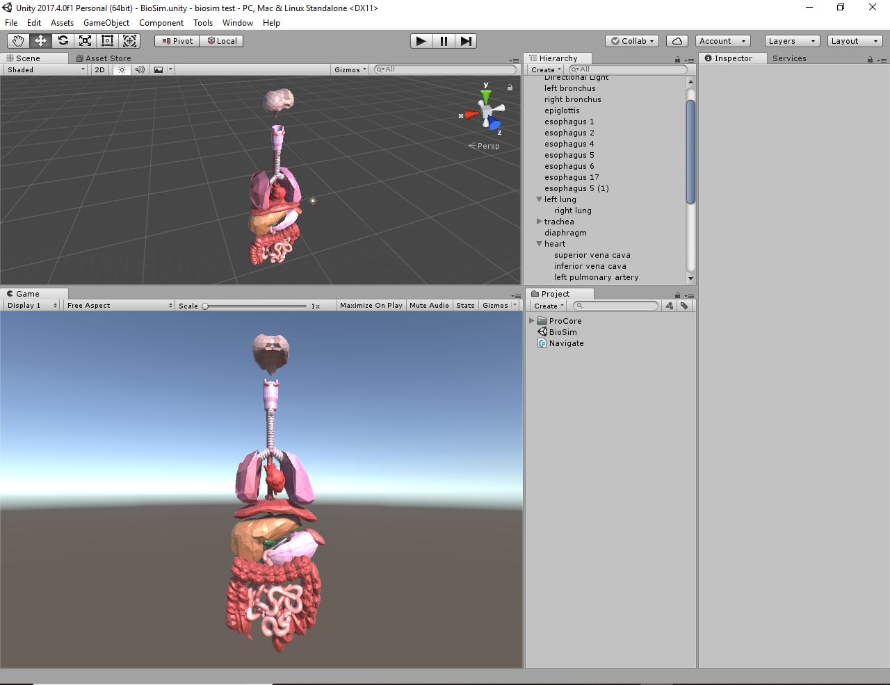

# human-anatomy-model
Model made playing around with Unity's ProBuilder asset; human digestive and respiratory systems. Built for learning ProBuilder modelling tools, not intended to be a scientifically accurate respresentation of human anatomy.

